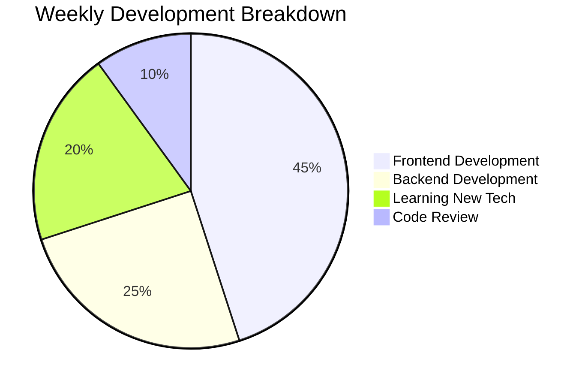

# 👋 Hi there, I'm Fadel Razsiah

  

## 🚀 About Me

I'm a passionate Software Engineer with expertise in web development and modern technologies. I love creating efficient, scalable applications and continuously learning new technologies to stay current in this fast-evolving field.

- 🔭 I'm currently working on **Web Development Projects**
- 🌱 I'm currently learning **Advanced React, TypeScript, and Node.js**
- 👯 I'm looking to collaborate on **Web Applications and APIs**
- 💬 Ask me about **JavaScript, React, PHP, and Web Development**
- 📫 How to reach me: **[hello@fadelrazsiah.com]**
- 🌍 Location: Jakarta, Indonesia
- 🌐 Portfolio: [fadel-razsiah.netlify.app](https://fadel-razsiah.com/)
- 💼 LinkedIn: [in/fadel-razsiah](https://linkedin.com/in/fadel-razsiah)

## 🛠️ Tech Stack

### Languages & Frameworks

### Frontend & Libraries

### Tools & Platforms

## 📊 GitHub Stats

  
  

## 🏆 Top Languages

  

## 🎯 Featured Projects

<table>
  <tr>
    <td width="50%">
      <h3 align="center">🛒 E-commerce App</h3>
      

        
      

      

        <strong>TypeScript • React • Modern E-commerce Solution</strong>
      

    </td>
    <td width="50%">
      <h3 align="center">👥 Users API</h3>
      

        
      

      

        <strong>Node.js • Express • RESTful API</strong>
      

    </td>
  </tr>
  <tr>
    <td width="50%">
      <h3 align="center">⏰ Countdown Timer</h3>
      

        
      

      

        <strong>HTML • CSS • JavaScript</strong>
      

    </td>
    <td width="50%">
      <h3 align="center">😊 Emoji Search</h3>
      

        
      

      

        <strong>React • JavaScript • Emoji API</strong>
      

    </td>
  </tr>
</table>

## 🏅 Achievements

  

## 🔗 Connect with Me

  
  
  

## 📊 Weekly Development Breakdown

## 🎯 Current Focus

- 🔥 **Building Modern Web Applications** with React and TypeScript
- 🚀 **Developing RESTful APIs** with Node.js and Express
- 💡 **Learning Advanced JavaScript** concepts and best practices
- 🌐 **Creating Responsive Web Designs** with modern CSS
- 📱 **Mobile-First Development** approach

## 📝 Latest Updates

- ✅ **E-commerce App**: Built with TypeScript and React
- ✅ **Users API**: RESTful API with Node.js and Express
- ✅ **Countdown Timer**: Simple HTML/CSS/JS project
- ✅ **Emoji Search**: React app with emoji API integration
- 🔄 **Invoice API**: PHP-based invoice management system
- 🔄 **Translation App**: Bangka Nese translation project

## 🎓 Education & Background

- **Software Engineering** - Focus on web development and modern technologies
- **Continuous Learning** - Always exploring new frameworks and tools
- **Problem Solving** - Passionate about creating efficient solutions

## 💼 Professional Interests

- **Web Development**: Full-stack development with modern technologies
- **API Development**: Building scalable and efficient RESTful APIs
- **User Experience**: Creating intuitive and responsive user interfaces
- **Performance Optimization**: Writing clean, efficient, and maintainable code

---

  
  
  ⭐ From [Fadel Razsiah](https://github.com/fadelrazh)

